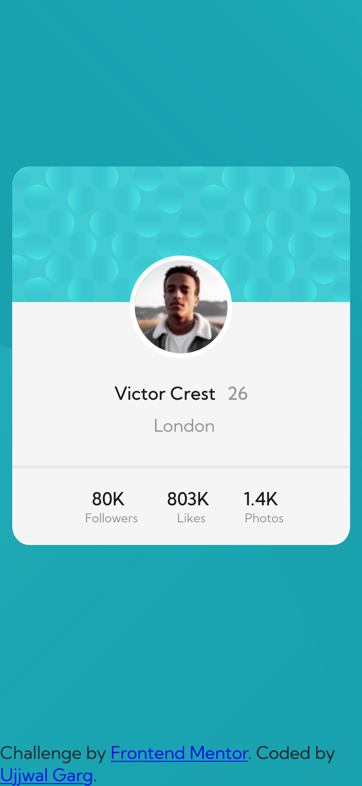

# Frontend Mentor - Profile card component solution

This is a solution to the [Profile card component challenge on Frontend Mentor](https://www.frontendmentor.io/challenges/profile-card-component-cfArpWshJ). Frontend Mentor challenges help you improve your coding skills by building realistic projects.

## Table of contents

-   [Frontend Mentor - Profile card component solution](#frontend-mentor---profile-card-component-solution)
    -   [Table of contents](#table-of-contents)
    -   [Overview](#overview)
        -   [The challenge](#the-challenge)
        -   [Screenshot](#screenshot)
            -   [Desktop Design](#desktop-design)
            -   [Mobile Design](#mobile-design)
        -   [Links](#links)
    -   [My process](#my-process)
        -   [Built with](#built-with)
    -   [Author](#author)

## Overview

### The challenge

-   Build out the project to the designs provided

### Screenshot

#### Desktop Design

  

#### Mobile Design

	 

### Links

-   Solution URL: [https://github.com/gargujjwal/Frontend-Mentors-Profile-card-component-solution](https://github.com/gargujjwal/Frontend-Mentors-Profile-card-component-solution)
-   Live Site URL: [https://gargujjwal.github.io/Frontend-Mentors-Profile-card-component-solution/](https://gargujjwal.github.io/Frontend-Mentors-Profile-card-component-solution/)

## My process

### Built with

-   Semantic HTML5 markup
-   CSS custom properties
-   Flexbox
-   CSS Grid
-   Mobile-first workflow

## Author

-   Website - [Ujjwal Garg](https://github.com/gargujjwal)
-   Frontend Mentor - [@gargujjwal](https://www.frontendmentor.io/profile/gargujjwal)
-   Instagram - [@gargujjwal](https://www.instagram.com/gargujjwal/)
-   Linkedin - [@gargujjwal](https://www.linkedin.com/in/ujjwal-garg-3a5639243/)
-   Twitter -[@UjwalGarg100204](https://twitter.com/UjwalGarg100204)
